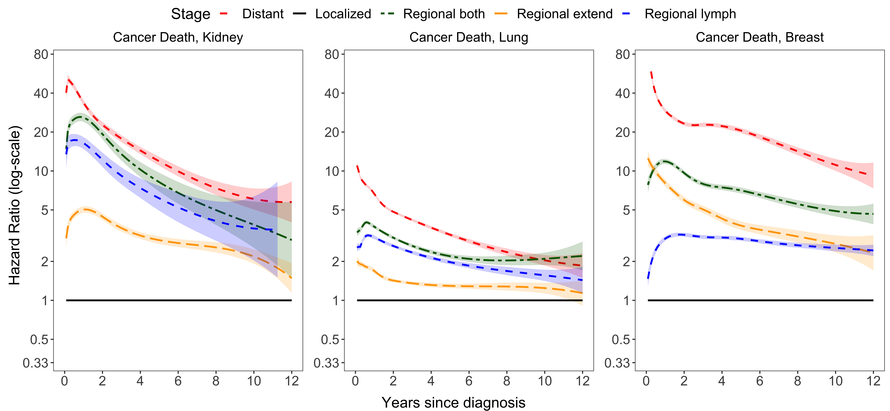

# Summary

The `surtvep` package is an open-source software designed for estimating time-varying effects in survival analysis using the Cox non-proportional hazards model in R. With the rapid increase in large-scale time-to-event data from national disease registries, detecting and accounting for time-varying effects in medical studies have become crucial. Current software solutions often face computational issues such as memory limitations when handling large datasets. Furthermore, modeling time-varying effects for time-to-event data can be challenging due to small at-risk sets and numerical instability near the end of the follow-up period. `surtvep` addresses these challenges by implementing a computationally efficient Kronecker product-based proximal algorithm, supporting both unstratified and stratified models. The package also incorporates P-spline and smoothing spline penalties to improve estimation. Cross-validation and information criteria are available to determine the optimal tuning parameters. Parallel computation is enabled to further enhance computational efficiency. A variety of operating characteristics are provided, including estimated time-varying effects, confidence intervals, hypothesis testing, and estimated hazard functions and survival probabilities. The `surtvep` package thus offers a comprehensive and flexible solution to analyzing large-scale time-to-event data with dynamic effect trajectories.

# Statement of Need

The Cox non-proportional hazards model is a flexible and powerful tool for modeling time-varying effects of covariates in survival analysis. However, as the size of a dataset increases, the computational costs of this model can become substantial. Current software solutions, which may be effective for smaller datasets, face challenges when handling larger datasets. 

Numerous studies have demonstrated the widespread presence of time-varying effects. For instance, the scientific literature has shown that factors like age, sex, and race can have non-constant associations with survival in cases such as end-stage renal disease [@he2017modeling; @he2022stratified], and breast cancer patients receiving neo-adjuvant chemotherapy and head and neck cancer patients [@baulies2015time; @brouwer2020time]. Ignoring the variations and relying solely on the Cox proportional hazards model can lead to inaccurate risk prediction and suboptimal treatment development.

With the rising need for modeling time-varying effects, researchers have developed methods to handle the data [@hastie1993varying; @zucker1990nonparametric; @gray1992flexible; @gray1994spline]. In terms of implementation, these methods expand the original data in a repeated measurement format [@therneau2017using] using existing software such as the `survival` package [@survival-package]. Even with moderate sample sizes, this leads to a large and computationally burdensome working dataset. `surtvep` addresses this issue by implementing a computationally efficient Kronecker product-based proximal algorithm [@perperoglou2006fast], which can handle time-varying effects in large-scale studies with improved efficiency and parallel computing capabilities. Compared with existing computational packages, such as the `coxph` function, `surtvep` demonstrates a much more efficient performance, with both runtime and memory consumption reduced considerably.

Another issue of numerical instability arises when analyzing data with binary covariates that have limited variation. `surtvep` implements a proximal Newton's method to improve the estimation. Additionally, adding a penalty can improve the estimation. `surtvep` also supports P-spline and smoothing spline [@eilers1996flexible; @wood2017generalized; @wood2017p], to further improve estimation stability. The improved estimation performance of `surtvep` is demonstrated in our recent studies [@wu2022scalable; @lfluo2023smmr].

Finally, our method has several other features worth noting. First, `surtvep` supports the stratified model, which enables researchers to account for differences in baseline hazard functions across distinct clusters or other grouping factors. This is particularly useful when there are distinct subgroups within the data that may have different baseline hazards. Second, `surtvep` enables shared-memory parallel computation features, which can significantly improve the performance of the software when working with large datasets. Also, `surtvep` supports Breslow approximation [@breslow1974covariance], which significantly improves the computational speed when a large number of times are present.

# Functions

![Flowchart for functions in the `surtvep` package. `coxtv` utilizes proximal Newton's method to estimate the time-varying coefficients. `coxtp` combines the Newton's approach with penalization. `IC` calculates different information criteria to select the best tuning parameter in front of the penalty term. `cv.coxtp` uses cross-validation for tuning parameter selection. `tvef.ph`, `tvef.ph.time` and `tvef.ph.zero` provide hypothesis testing for the fitted model. `get.tvef` retrieves the time-varying coefficients for the fitted model. `confint` provides confidence intervals for these coefficients.  `baseline` offers the baseline hazard estimations. `plot` visualizes the estimated time-varying coefficients. \label{fig:flowchart}](flowchart.pdf)

`surtvep` is a powerful statistical software package designed for analyzing time-varying effects of time-to-event data. The software offers two main functions for estimating time-varying coefficients in survival analysis.

To model time-varying coefficients in `surtvep`, we first define the time-varying coefficients as $\boldsymbol{\beta}(t)$, which represents the effects of predictor variables on the outcome at different points in time. We then use a set of B-spline basis functions to span the $\boldsymbol{\beta}(t)$, which provides a flexible and accurate way to capture the time-dependent effects of the predictors. These B-spline basis functions are generated using the `splines` R package with a fixed number of basis functions.

Once we have established the basis functions for the time-varying coefficients, `coxtv` employs a proximal Newton's approach to estimate the coefficients in front of the B-spline basis functions. This approach iteratively updates the coefficients until a maximum of the log-partial likelihood is reached. Backtracking line search is utilized to improve the estimation. We have also implemented a shared-memory parallelization to enable faster convergence. 

`coxtp` is the second main function, adding a penalty term to the original objective function. This approach iteratively updates the coefficients until a maximum of the penalized log-partial likelihood is reached. `coxtp` provides two options for penalized regression: P-spline and smoothing spline. 

* P-spline stands for penalized B-spline. It combines the B-spline basis with a discrete quadratic penalty on the difference of basis coefficients between adjacent knots. When the penalty term goes to infinity, the time-varying effects are reduced to be constant. 
* Smoothing spline is a derivative-based penalty combined with B-spline. When the cubic B-spline is used for constructing the basis functions, the smoothing spline penalizes the second-order derivative, which reduces the time-varying effect to a linear term when the penalty term goes to infinity.  When the quadratic B-spline is used for constructing the basis functions, the smoothing spline penalizes the first-order derivative, which reduces the time-varying effect to a constant when the penalty term goes to infinity. See @wood2017p for details.

`surtvep` also provides a function `IC` to select the best tuning parameter in front of the penalty term. `IC` can be used to calculate the modified Akaike information criterion (mAIC), the Takeuchi information criterion (TIC) and the generalized information criterion (GIC) [@akaike1998information; @takeuchi1976distribution; @lfluo2023smmr]. Generally, mAIC, TIC and GIC have relatively similar performance. Using one of these criteria to select tuning parameters is considerably faster than using cross-validation, which is also provided in `surtvep` via function `cv.coxtp`.

Finally, `surtvep` offers a comprehensive suite of hypothesis testing capabilities, allowing researchers to assess the validity and significance of their models. Specifically, `surtvep` can perform the following hypothesis tests: (1) testing the proportional hazards assumption to verify the model's suitability for the given data; and (2) examining the pointwise significance of covariates effects at different event times to assess the impact of each covariate on the outcome of interest. To conduct these hypothesis tests, `surtvep` employs the Wald test statistic, a widely-used method for inference.

# Quick Start 

The purpose of this section is to introduce the basics of `surtvep`. Interested users are referred to the online tutorial at [*https://um-kevinhe.github.io/surtvep/index.html*](https://um-kevinhe.github.io/surtvep/index.html) for detailed instructions.

`surtvep` can be easily installed by launching an R prompt and running the following commands:

```r
require("remotes")
remotes::install_github("UM-KevinHe/surtvep")
```

Next, we load an example data set that includes two columns `z` of continuous covariates, a column `time` indicating the time to an event, and a column "event" of event indicators.

```r
data("ExampleData")
z     <- ExampleData$z
time  <- ExampleData$time
event <- ExampleData$event
```

We can fit the Newton’s method without penalization using the most basic call to `coxtv`. For the Newton’s method with penalization, we call the `coxtp` function.

```r
fit.tv <- coxtv(z = z, event = event, time = time)
fit.penalize <- coxtp(z = z, event = event, time = time)
```

We use `IC` to calculate the information criteria and select the best tuning parameter:

```r
fit.ic <- ic(fit.penalize)
```

`fit.tv` is an object of class `coxtv` that contains all the relevant information of the fitted model for further use.
`fit.ic` contains three objects of class `coxtp`, corresponding to the selected model using mAIC, TIC and GIC.
Various methods are provided for the objects such as plotting and hypothesis testing.

We can visualize the time-varying coefficients through the plot method:

```r
plot(fit.tv, ylim = c(-2,2))
plot(fit.ic$mAIC, ylim = c(-2,2))
```


# Data Example 

We demonstrate the effectiveness of `surtvep` by applying it to a real-world dataset from the National Cancer Institute Surveillance, Epidemiology, and End Results (SEER) Program [@SEER]. We estimate the cancer stage of kidney, lung, and breast, as shown in \autoref{fig:example}. Our analysis highlights the dynamic nature of hazard ratios for cancer death among patients with metastatic stage compared to those with localized stage.

In the first year after diagnosis, the hazard ratio is strikingly high, indicating a significant difference in survival outcomes between metastatic and localized stage patients. However, this disparity shrinks considerably by the eighth year, reflecting the diminishing relevance of the initial cancer stage in the prognosis of long-term survivors. This example illustrates the importance of accounting for time-varying effects, which has been effectively addressed by `surtvep` through its flexible and efficient approach to modeling these dynamics. By providing accurate and efficient modeling of time-varying effects in large-scale datasets, `surtvep` serves as a valuable tool for researchers working with complex survival data.



# Availability

Stable releases of the `surtvep` package will be made available via the Comprehensive R Archive Network. Alternatively, the `surtvep` package is available on GitHub [(*https://github.com/UM-KevinHe/surtvep*)](https://github.com/UM-KevinHe/surtvep). Use of the `surtvep` package has been extensively documented in the package documentation and on the tutorial website [(*https://um-kevinhe.github.io/surtvep/index.html*)](https://um-kevinhe.github.io/surtvep/index.html).

# Funding

This project was partially supported by the US National Cancer Institute (R01CA-129102) and National Institute of Diabetes and Digestive and Kidney Diseases (R01DK-129539).

# References

